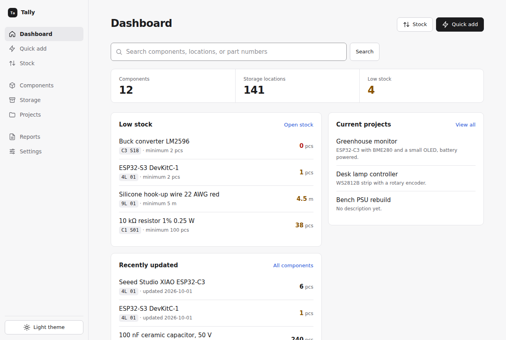

<h1 align="center">Tally</h1>

<p align="center">Knows what parts you have, how many are left, and which drawer they live in.</p>

<p align="center"></p>

Tally is a self-hosted inventory for an electronics workshop. One container, one SQLite file, no accounts, works on a phone at the bench. Releases are published as `ghcr.io/alankey-dev/tally` images.

[MIT licensed](LICENSE).

## Features

- **Quick add.** Type what arrived, pick the matching variant, enter a count. Fuzzy matching forgives typos and spacing. Known parts come prefilled from a catalogue you can import from a file or URL in Settings.
- **Scan to receive.** Scan the 2D code on a Digi-Key, Mouser, Farnell, LCSC or TME bag into Quick add. Tally reads the part number, quantity and supplier SKU, opens the receive form, and you press Enter. Unknown parts open New component prefilled. With no scanner, tap **Scan a bag label** and take a photo; this works over plain HTTP, with no HTTPS needed.
- **Labels.** Print QR labels for drawers and parts; scan one with any phone camera to open that drawer's stock.
- **Stock checkout.** Build a list, then record use, receipt, return, or loss in one action.
- **Permanent homes.** Every part has a coded drawer or box. Search by name, part number, value, package or location code, such as `10k 0603` or `100nF 50V`. On Components, filter by component family and by attribute chips such as package, and set a value range for resistors and capacitors.
- **Low stock.** Set a minimum and the dashboard flags it, and the Order list suggests what to buy.
- **Order list.** Turn low stock and project shortages into order entries, export them as CSV or Mouser part-list text, mark them ordered with a supplier and expected date, then tap Received to put the stock in.
- **Attachments.** Attach a datasheet PDF, a pinout photo or a link to any item, and open it with one tap. Share one with every item made from the same quick add catalogue entry. Components marked with a file icon have attachments.
- **Stocktake.** Walk a storage location or a whole group on your phone, tick what matches, type what doesn't. Differences become stock movements, and the dashboard shows what is due a count.
- **Projects.** Keep each build's bill of materials, see how many you can build from stock and which lines fall short, then build ×N to take every part in one go. Undo if you change your mind. Import a KiCad, EasyEDA or JLCPCB BOM CSV and match it to your items. Export the BOM as CSV or PDF.
- **Webhooks.** Send app events to external services, or locate an item with a drawer LED controller. Subscribe to individual events or all events. See [webhook events and payloads](docs/webhooks.md).
- **Live display.** Open the dashboard on a spare tablet; it refreshes when anything changes.
- **Light and dark**, system fonts, keyboard friendly, WCAG AA colours.

### Barcode scanners

Use a USB or Bluetooth scanner in keyboard mode, and turn on GS (Ctrl+]) in its settings so Digi-Key and Mouser labels split correctly. Tally handles the Ctrl+] and Ctrl+D key presses that scanners send, so the browser's bookmark dialog does not open and lose the scan.

## Quick start

```sh
mkdir tally && cd tally
curl -fsSLO https://raw.githubusercontent.com/alankey-dev/tally-oss/main/docker-compose.yml
docker compose up -d
```

Open <http://localhost:8000>. Data lives in the `tally-data` Docker volume.

Or with plain Docker:

```sh
docker run -d --name tally -p 8000:8000 -v tally-data:/data ghcr.io/alankey-dev/tally:latest
```

The image runs on `amd64` and `arm64`, so a Raspberry Pi works too.

## First steps

1. **Add your storage.** Under **Storage**, add each drawer, shelf or box with a short permanent code such as `CAB1 S01`. Codes are grouped by their first word.
2. **Print labels for your storage.** Under **Storage**, choose **Print labels**, print the PDF at actual size and stick one on each drawer.
3. **Add parts.** Use **Quick add** at the bench: type what arrived, pick the variant, enter a count.
4. **Lock it.** Under **Settings**, set an access password and require sign-in before anyone else can reach Tally.

Prefer to start from a ready-made layout? Set `TALLY_LAYOUT=example` before the first start for three 43-drawer cabinets and a set of boxes, or point it at your own JSON file (see [CONTRIBUTING.md](CONTRIBUTING.md#sharing-a-storage-layout)). It only applies while there is no storage yet.

## Configuration

| Variable | Default | Purpose |
| --- | --- | --- |
| `TALLY_PORT` | `8000` | Host port (Compose only). |
| `SECRET_KEY` | generated | Signs the session cookie. If unset, one is generated and kept in the data volume. |
| `TALLY_LAYOUT` | empty | Storage to create on first run: `example`, or a path to a JSON layout. |
| `STORAGE_DB` | `/data/storage.db` | SQLite database path. |
| `STORAGE_UPLOADS` | `/data/uploads` | Uploaded images and attachments. |

Copy `.env.example` to `.env` to set these with Compose.

QR labels open the address you reached Tally at, which a phone may not be able to use (`localhost`, or a bare hostname). Under **Settings → Labels**, set the label address, such as `https://tally.example.lan`. Tally warns before you print if the address looks unreachable.

## Exposing it to the internet

Tally has one shared password, not user accounts. Before it is reachable from outside your network, put it behind a reverse proxy with HTTPS and require sign-in. See [SECURITY.md](SECURITY.md).

Attachments can be up to 20 MB, and the app waits up to 120 s for an upload to finish. Raise your proxy's upload size limit to match (nginx allows only 1 MB by default) and its timeout to at least 120 s.

## Backups

**Settings → Download backup** saves the SQLite database. **Settings → Download full backup** saves a zip of the database and the `uploads` folder with every image and attachment. Restoring from the zip is manual. To back up the whole volume instead:

```sh
docker run --rm -v tally-data:/data -v "$PWD":/backup alpine tar czf /backup/tally-backup.tgz -C /data .
```

## Development

See [CONTRIBUTING.md](CONTRIBUTING.md). To build the image yourself, run `docker compose up -d --build`.

Pushing a `v*` tag runs the tests and publishes a multi-arch image to GitHub Container Registry.
